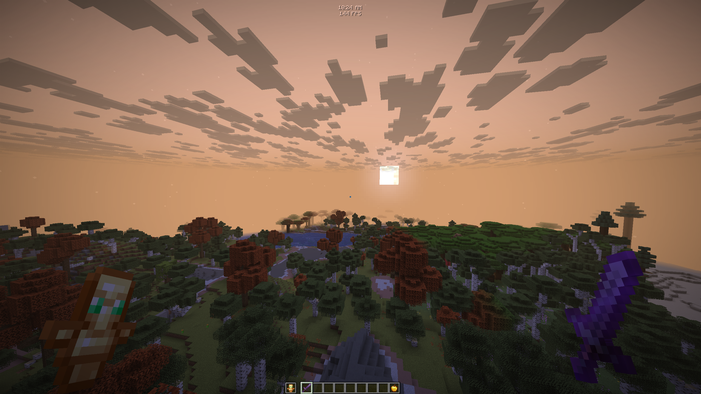

A collection of configurations & examples of what you can do with [🦋 Velquorin](https://github.com/clemenside/velquorin).

## How to import a configuration?
1. Pick a configuration from the list below
2. Hover over its name, right-click, and copy the link.
3. In the client UI (`Right Shift`), open the *Miscellaneous* tab (globe icon) and click **Import**.

## 🌅 Radiant sunrise

---
[This repository is released to the public domain.](LICENSE)
