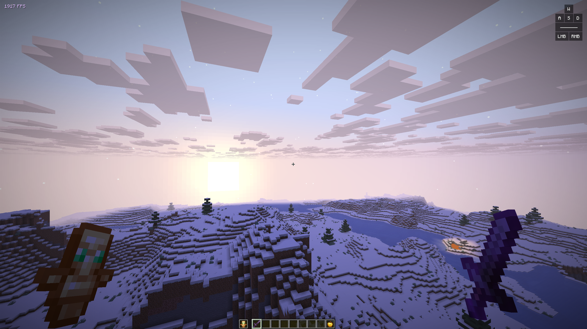

A collection of configurations & examples of what you can do with [🦋 Velquorin](https://github.com/velquorin/client).

## How to import a configuration?
1. Pick a configuration from the list below
2. Hover over its name, right-click, and copy the link.
3. In the client UI (`Right Shift`), open the *Miscellaneous* tab (globe icon) and click **Import**.

## [🌅 Radiant sunrise](https://raw.githubusercontent.com/velquorin/examples/refs/heads/main/assets/radiant-sunrise.json)
*Modules used: View Model, Ambiance, FPS, Clock*

## [🍰 Pastel](https://raw.githubusercontent.com/velquorin/examples/refs/heads/main/assets/pastel.json)
*Modules used: View Model, Ambiance, FPS, Key strokes*

---
[This repository is released into the public domain.](LICENSE)
